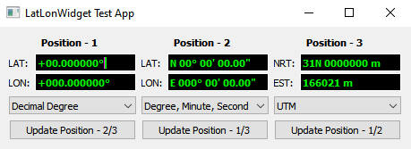

# LatLonWidget
Latitude Longitude Widget Developed in Qt

This LatLonWidget provide an GUI for entering latitude and longitude values in different format.
Following formats are supported:
1. Decimal Degree
2. Degree, Minute and Second (DMS)
3. Universal Transverse Mercator (UTM)

This software uses the library available at [git repo](https://github.com/bakercp/ofxGeo.git) for conversion from UTM to Latitude and Longitude and visa versa.

## How To Use The Widget
Copy the latlonwidget.h and latlonwidget.cpp file into your project. 
Then you can create the latlonwidget at runtime using 
```cpp
LatLonWidget *w = new LatLonWidget;
```

To use the widget in QCreator Designer Form, insert a Widget on the designer form and prompte it latlonwidget.

## Test Application
This repor include a test program to test the widget. Clone the repo and build the project to use the test program.




